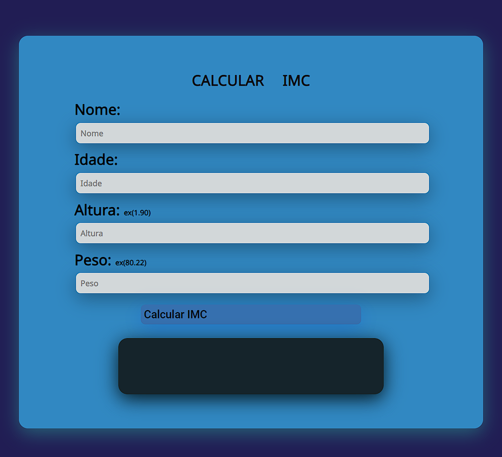

# Calculador IMC

o Índice de Massa Corporal, conhecido pela sigla IMC, é um cálculo simples que permite medir se alguém está ou não com o peso ideal.

## Demonstração

## Para saber o seu imc, acesse o site abaixo
https://imc-five-pi.vercel.app/
